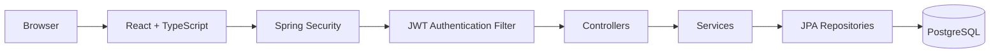

# EasyLang Activity Monitoring

<p align="center">
  
  
  
  
  
</p>

**Full-stack activity tracking system with secure authentication, role-based workspaces, and translator progress records.**

The repository contains an independent Spring Boot API and React/TypeScript frontend. The strongest part of the project is the security and access model: authentication is enforced on the server, protected again in the client, and tied to real database-backed roles.

## What stands out

- **Secure auth** — Spring Security + BCrypt + JWT stored in an `HttpOnly`, `SameSite=Lax` cookie.
- **CSRF protection** — the frontend requests and sends CSRF tokens for state-changing requests.
- **Double-layer RBAC** — Translator, Chief Editor, and Project Manager access is protected on both backend and frontend.
- **Activity workflow** — translators can view assigned activities, create/update work records, and track progress.
- **Database discipline** — PostgreSQL + Flyway migrations, constraints, uniqueness rules, and indexes.
- **Verification** — backend integration tests, frontend unit tests, lint/build gates, and Playwright end-to-end coverage.

## Request flow



## Roles

| Role | Workspace |
| --- | --- |
| Translator | Assigned activities and work records |
| Chief Editor | Protected editor workspace |
| Project Manager | Protected manager workspace |

## Run locally

```bash
docker compose up -d --wait

cd backend
mvn spring-boot:run
```

In another terminal:

```bash
cd frontend
npm install
npm run dev
```

Open `http://localhost:5173`.

## Verify

```bash
cd backend && mvn test
cd frontend && npm test
cd frontend && npm run lint
cd frontend && npm run build
cd frontend && npm run test:e2e
```

For deeper technical notes, see `docs/ARCHITECTURE.md`, `docs/API.md`, and `docs/SPRINT_1_STATUS.md`.
